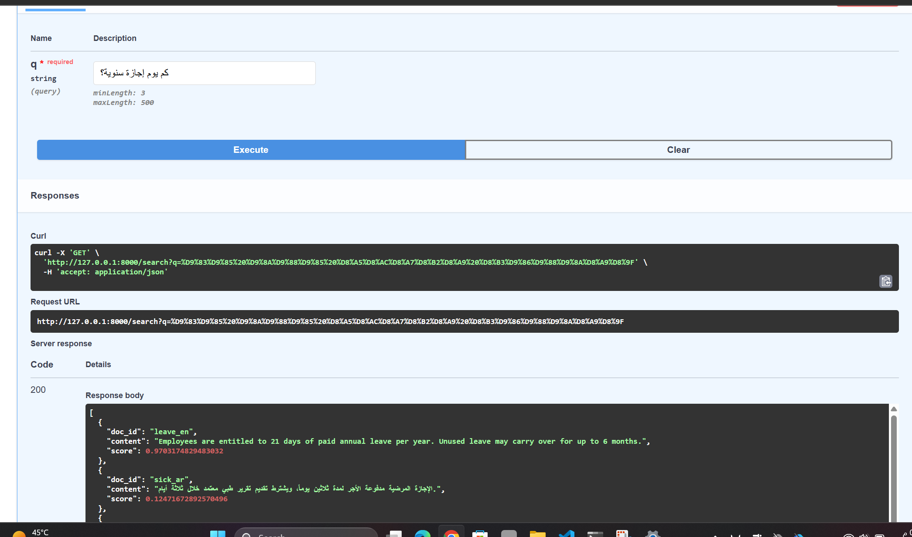

# NEXA — Bilingual Enterprise Retrieval

A production-oriented Arabic/English retrieval system for enterprise documents.
An employee asks in Arabic; the system finds the answer in an English policy
document, and vice versa.

**Status:** Retrieval layer complete and measured. Agent, tool layer, and
human-in-the-loop approvals are specified in `docs/` and not yet built.

All data in this repository is synthetic. No real company, person, or policy
is used.

---

## The problem

Enterprise policies live in mixed Arabic and English documents. An Arabic
speaker asking about annual leave should get the answer even when the only
document covering it is in English.

Dense vector retrieval alone does not do this well. It ranks by language before
it ranks by meaning.

---

## Measured result

Evaluation set: 12 documents (6 EN, 6 AR), each topic in one language only.
24 questions, all strictly cross-lingual — the correct answer is never in the
same language as the question.

| Pipeline | Recall@1 | Recall@5 | Same-language bias |
|---|---|---|---|
| Dense retrieval only | 0.38 | 0.92 | 0.62 |
| Dense + cross-encoder rerank | **0.92** | — | **0.08** |

Same-language bias measures how often the top result shares the query's
language. 0.50 is neutral. Dense retrieval alone sat at 0.62 and capped
Recall@1 at 0.38. Reranking dropped the bias to 0.08 and lifted Recall@1
to 0.92.

Recall@5 of 0.92 under dense retrieval shows the correct document was almost
always *retrieved*. The failure was in **ranking**.

Full method, corrections, and limitations: [`docs/adr/ADR-009-embeddings.md`](docs/adr/ADR-009-embeddings.md)

---

## Two corrections made during evaluation

Both are documented rather than quietly fixed, because how a result was reached
matters as much as the result.

**1. An early improvement was overfitting.** Per-language mean centering
appeared to lift Recall@1 from 0.50 to 0.80. On a held-out split the same
technique scored 0.08. It was rejected.

**2. The evaluation harness itself was wrong.** A dataset that paired every
topic with a translated twin required the model to pick the *foreign-language*
twin. When an English query was answered from an English document, the harness
scored it wrong — though that is correct behaviour. A reported Recall@1 of 0.00
was measuring a broken metric, not a broken system. Inspecting raw reranker
scores exposed it; aggregate numbers did not.

---

## Architecture

Key decisions, with rationale and rejected alternatives, are in
[`docs/ARCHITECTURE.md`](docs/ARCHITECTURE.md).

The design that the retrieval layer will slot into — a tool layer that enforces
permissions in code rather than in prompts, and an approval gate that no
sensitive action can bypass — is specified in
[`docs/PRD.md`](docs/PRD.md) and section 13 of the architecture document.

---

## Stack

Python 3.12 - FastAPI - PostgreSQL 17 - SQLAlchemy 2.0 -
`intfloat/multilingual-e5-large` (retrieval) - `BAAI/bge-reranker-v2-m3` (rerank)

---

## Running locally

Requires Python 3.12 and PostgreSQL 17.

```bash
python -m venv .venv
.venv\Scripts\activate          # Windows
pip install -e .

createdb -U postgres nexa
cp .env.example .env            # then set your password

python -c "from nexa.db.connection import engine; from nexa.db.models import Base; Base.metadata.create_all(engine)"
python src/nexa/db/seed.py

uvicorn nexa.api.main:app --reload
```

Open http://127.0.0.1:8000/docs and try `/search` with an Arabic question.

Models are downloaded on first run (~2.5 GB).

---

## Tests

```bash
pytest -v
```

Includes a regression guard that fails if cross-lingual Recall@1 drops
below 0.85.

---

## Known limitations

- Evaluation set is 12 documents / 24 questions. Directional, not precise.
- Embeddings are stored as JSON text and compared in Python. pgvector is the
  intended replacement once the corpus grows past a few hundred chunks.
- Residual same-language bias remains at 0.08; two of 24 queries still fail
  this way.
- Only one model family tested per stage.
- Reranker latency not yet measured against the 1.5s p95 target.

---

## Next

Chunking for multi-section documents, then the tool layer, then the
approval flow.
---

## Demo

An Arabic query returning an English source document:



The correct English document scores 0.97; the closest Arabic document scores
0.12. The gap shows the reranker is deciding on meaning, not language.
